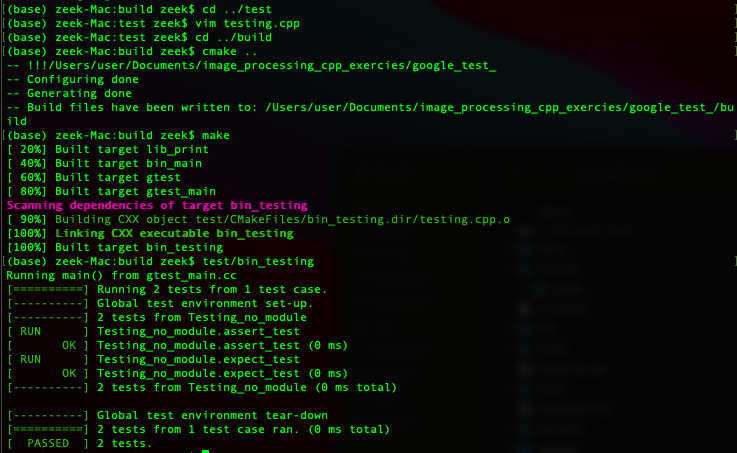

# Google Test: Introduction to Unit testing with practice example

## Introduction
Google Test is a xUnit unit testing framework (library) created by google as an in-house testing system and eventually open sourced on Github to enable developers design unit tests. Survey shows that a vast majority of c++ developers that perform unit testing using the googletest framework. Thus, it is a reliable testing library that is compatible with CMake and portable on various operating systems.

In this repo, I perform a successful unit test, having taken lectures on the framework. It is worth noting that this is a basic unit test, but it is scalable to complex or larger projects. The library tested in this project is a simple *print* library.

## Installation
The following libraries are needed to run the project and generally perform any googletest unit testing.
* cmake
* googletest (gtest)

### CMake Installation
#### Linux
The installation of CMake on a linux distribution such as ubuntu would require that the following command is run in the terminal.

	sudo apt-get install cmake

#### MacOS
Installing cmake on macos would require that you already have a package installer configured on your machine. In this case, homebrew would be used. Homebrew is a very reliable package installer and manager for Mackintosh machines and can be installed using the following commands run in your terminal.

	/bin/bash -c "$(curl -fsSL https://raw.githubusercontent.com/Homebrew/install/HEAD/install.sh)"

	*Note*; Plese refer to [Homebrew](https://brew.sh/) for the updated information on installation procedure.

After brew installation, the simple command given below can be used to install cmake using homebrew.

	brew install cmake

### Google Test Installation
#### Linux
The installation of googletest (gtest) on a linux distribution is similar to installing cmake, a simple command given below can be used to install the framework into the "usr/src" directory.
       
        sudo apt-get install libgtest-dev

#### MacOS
Again, the homebrew packakge installer can be used to install googtest on a mackintosh machine using the command:
	
	brew install googletest

Similarly, the googletest library can be built after cloning the installation repo. 

	git clone https://github.com/google/googletest.git
	cd googletest
	mkdir build
	cd build
	cmake ..
	make install

In this project, we only cloned the repo as a subdirectory of the project and used the *add_directories()* cmake command to ensure cmake identifies the library.

	git clone  https://github.com/google/googletest -b release-1.8.0 

Additionally, googletest can be remotely included to the test at cmake compilation/build. refer to [Google test installation documentation](https://github.com/google/googletest/blob/main/googletest/README.md) for more information.

## Instructions
To build this project after the necessary installations, Run the following commands.

	cd build
	cmake ..
	make

Finally, Run the test using the following commands to see the result displayed below.

	./test/bin_testing

## Result
Test result are indicated in the image below. *Run Ok* indicates that the module works and *PASSED* indicates that the declared test case where. In this case, 2 tests were run.

## References
* [Google Test](https://github.com/google/googletest)
* [UniBonn Google Test Lecture](https://youtu.be/q8xO2eJijy4)
* [GTest Wikipedia](https://en.wikipedia.org/wiki/Google_Test)
* [Stack Share Survey](https://stackshare.io/google-test)
